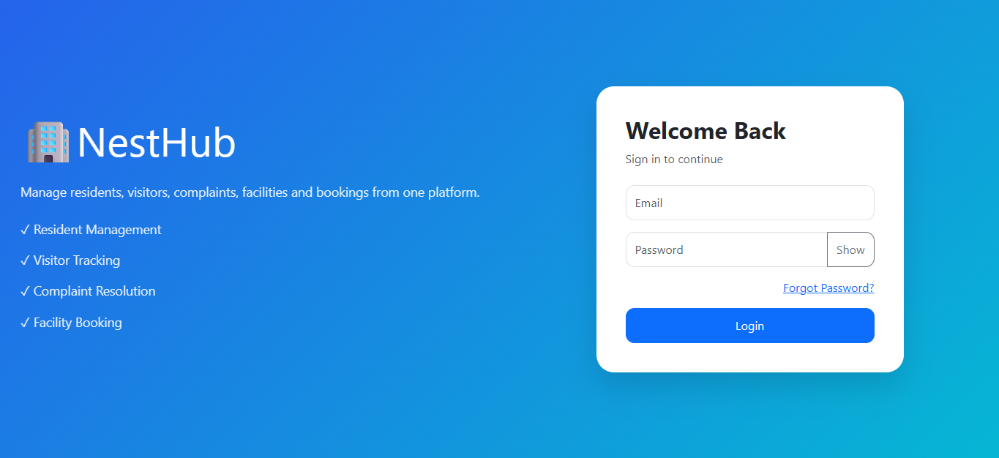
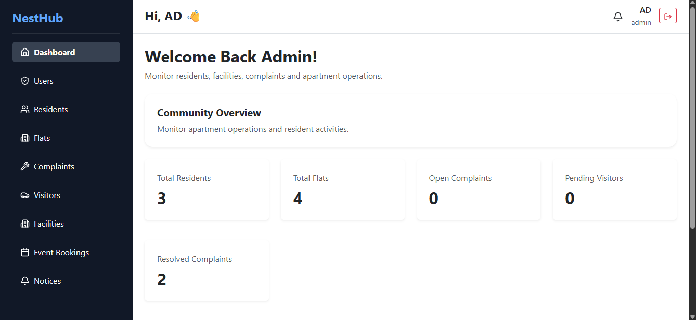
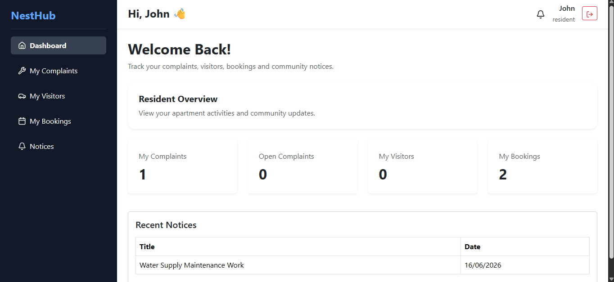
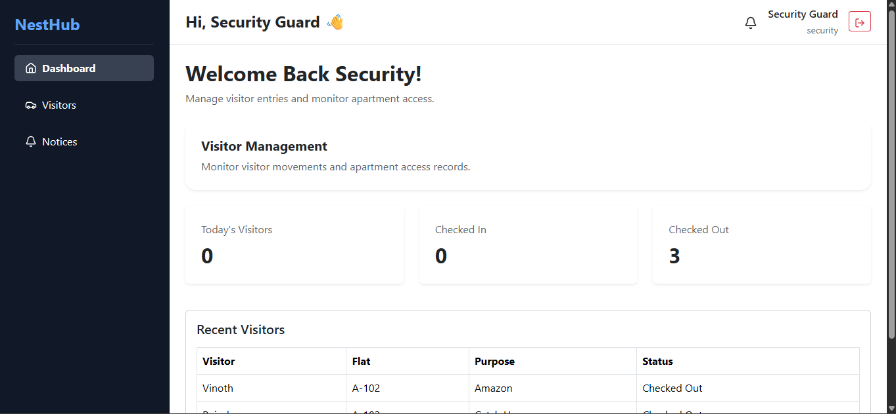
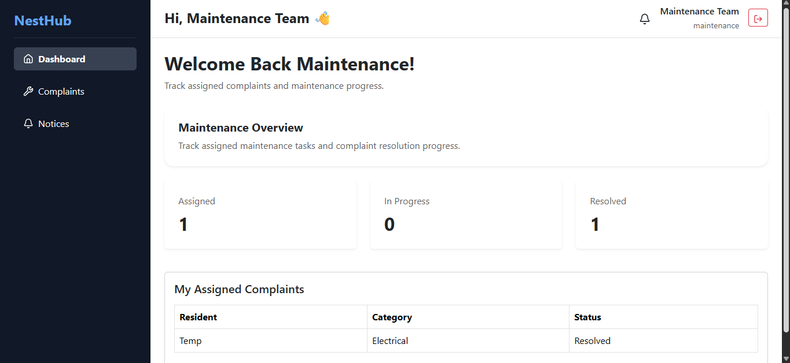

NestHub - Apartment Management System

1) Overview

The Apartment Management System (APMS) is a full-stack MERN application that I developed to simplify the day-to-day management of apartment communities. The system provides separate interfaces for administrators and residents, allowing them to manage complaints, visitors, notices, and apartment-related information through a secure, role-based platform.

2) Features

  (i) Authentication
  * Secure user authentication using JWT
  * Role-based access control for Admin and Resident users
  * Protected API routes

  (ii) Admin
  * Manage residents and apartment flats
  * View and update complaint status
  * Create and manage notices
  * View visitor records
  * Access dashboard statistics

  (iii) Resident
  * Register complaints
  * Track complaint status
  * View apartment notices
  * View visitor information
  * Access a personalized dashboard

  (iv) Maintenance
  * Register and manage maintenance requests
  * Track the status of maintenance issues
  * Maintain apartment-related service records

  (v) Security
  * Secure login with JWT authentication
  * Protected routes and role-based authorization
  * Visitor record management for improved apartment security

3) Technology Stack

  (i) Frontend
  * React.js
  * React Router
  * Context API
  * Axios
  
  (ii) Backend
  * Node.js
  * Express.js
  * REST APIs
  * JWT Authentication
  
  (iii) Database
  * MongoDB
  * Mongoose

4) Project Structure

APMS/
│
├── backend/
│   ├── config/
│   ├── controllers/
│   ├── middleware/
│   ├── models/
│   ├── routes/
│   └── server.js
│
├── frontend/
│   ├── public/
│   ├── src/
│   └── package.json
│
└── README.md

5) Installation

  (i) Clone the repository
    git clone https://github.com/<your-github-username>/Apartment-Management-System.git

  (ii) Install backend dependencies
    cd backend
    npm install

  (iii) Install frontend dependencies
    cd ../frontend
    npm install

  (iv) Environment Variables
    Create a 'config.env' file inside the 'backend/config' directory and configure the following variables:
    PORT=
    MONGO_URI=
    JWT_SECRET=

  (v) Run the backend
    cd backend
    npm start

  (vi) Run the frontend
    cd frontend
    npm run dev

6) Screenshots

Add screenshots of the following pages:

* Login Page
  
* Admin Dashboard
  
* Resident Dashboard
  
* Security Dashboard
  
* Maintenance Dashboard
  

7) Future Improvements

Some features that can be added in future versions include:

* Online maintenance payment integration
* Email notifications
* Push notifications
* Document upload support
* Mobile responsiveness improvements
* Analytics dashboard

8) What I Learned

Through this project, I gained practical experience in:

* Building REST APIs using Express.js
* Developing frontend applications with React
* Implementing JWT-based authentication and authorization
* Designing MongoDB databases with Mongoose
* Managing application state and routing
* Building a complete full-stack MERN application

Author
Aadhithya Pattabiraman
